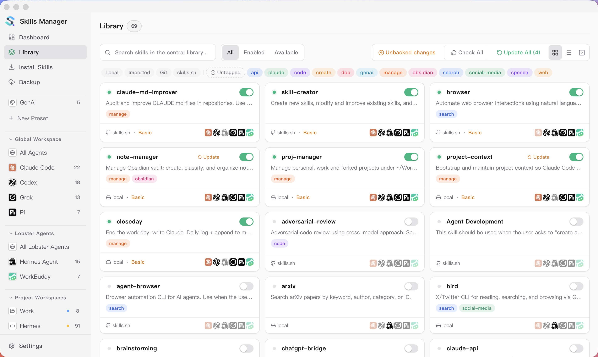
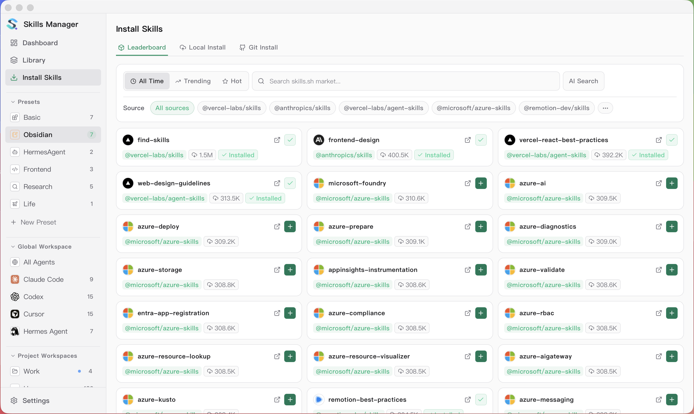
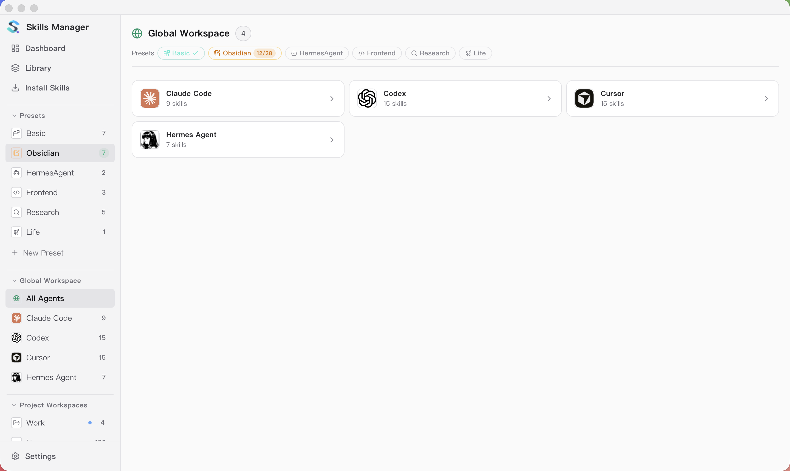
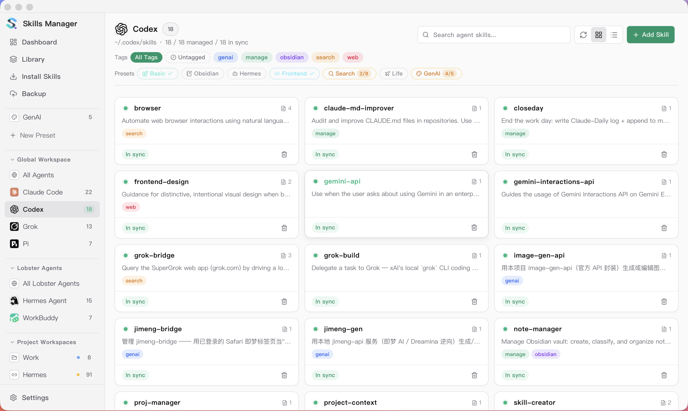
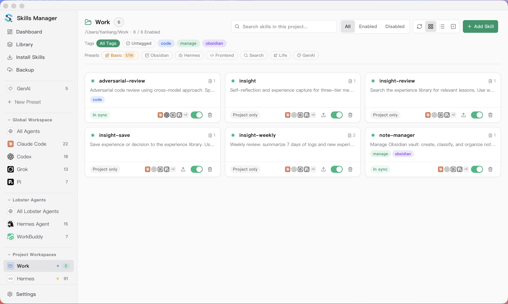
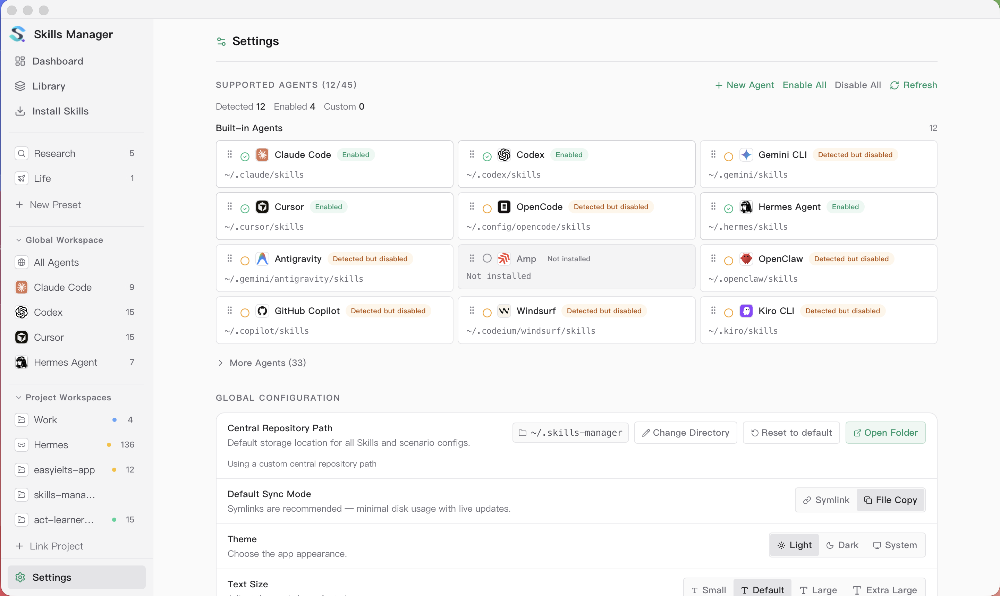
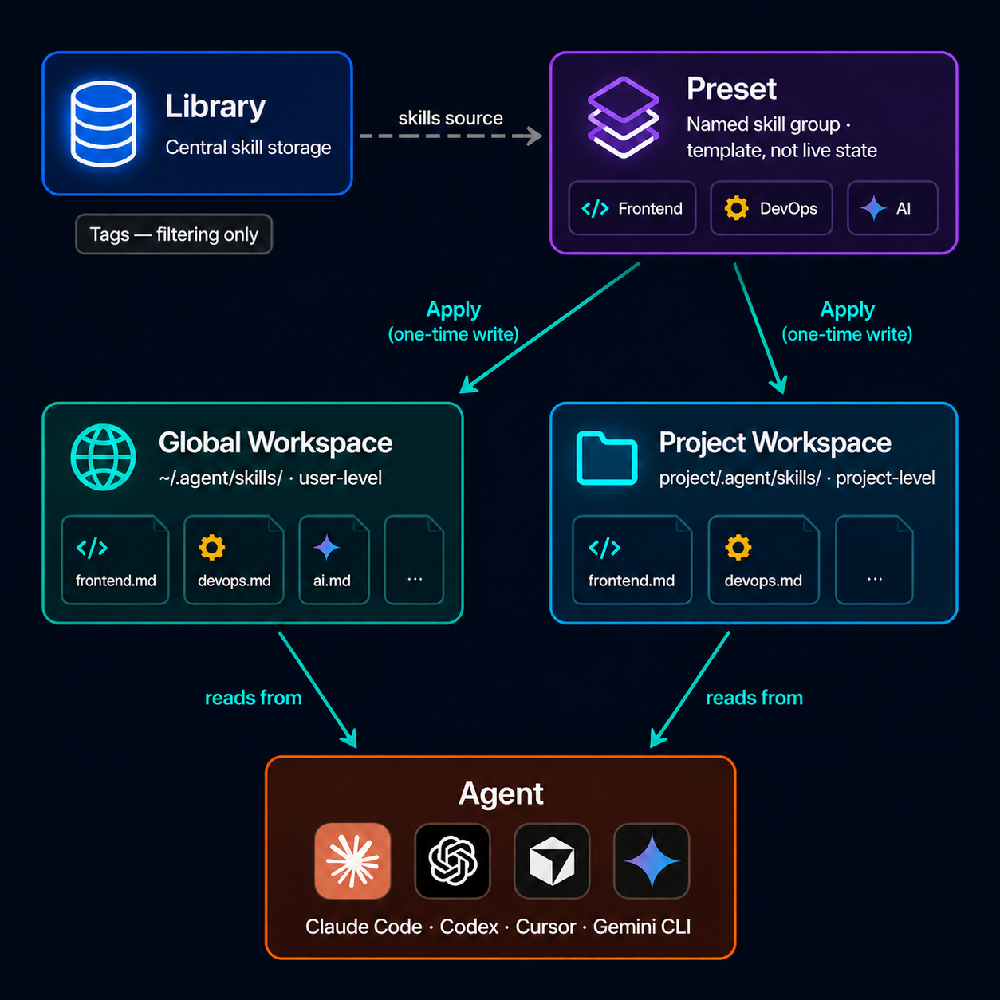
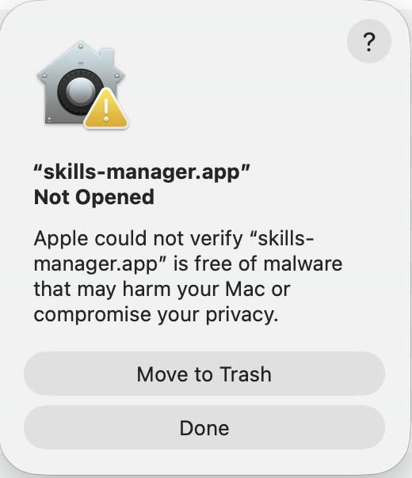

<p align="center">
  
</p>

<h1 align="center">Skills Manager</h1>

<p align="center">
  Eine App zur Verwaltung von AI-Agent-Skills über alle deine Coding-Tools hinweg.
</p>

<p align="center">
  <strong><a href="https://github.com/StonesA3A2/Skill-Manager">github.com/StonesA3A2/Skill-Manager</a></strong>
</p>

<p align="center">
  <a href="./README.md">English</a> &nbsp;·&nbsp;
  <b>Deutsch</b> &nbsp;·&nbsp;
  <a href="./README.zh-CN.md">简体中文</a> &nbsp;·&nbsp;
  <a href="./README.zh-TW.md">繁體中文</a>
</p>

<p align="center">
  
</p>

<p align="center"><strong>Skills installieren — Marktplatz</strong></p>
<p align="center"></p>

<p align="center"><strong>Globaler Arbeitsbereich</strong></p>
<p align="center"></p>

<p align="center"><strong>Agenten-Arbeitsbereich</strong></p>
<p align="center"></p>

<p align="center"><strong>Projekt-Arbeitsbereich</strong></p>
<p align="center"></p>

<p align="center"><strong>Sicherung & Multi-Geräte-Sync</strong></p>
<p align="center"></p>

<p align="center"><strong>Einstellungen</strong></p>
<p align="center"></p>

## Funktionen

- **Einheitliche Skill-Bibliothek** — Skills aus Git-Repos, lokalen Ordnern, `.zip`/`.skill`-Archiven oder dem [skills.sh](https://skills.sh)-Marktplatz installieren. Alles landet in einem zentralen Repository, standardmäßig `~/.skills-manager`, anpassbar in den **Einstellungen**.
- **Marktplatz** — Beliebte Skills durchsuchen und per Stichwortsuche finden.
- **Presets** — Skills zu benannten Presets gruppieren. In jedem Arbeitsbereich eine Preset-Pille anklicken, um alle ihre Skills für den aktuellen Agenten-Bereich sofort zu aktivieren oder zu deaktivieren. Die Seitenleiste listet alle Presets für schnellen Zugriff.
- **Globaler Arbeitsbereich** — Jeder Agent bekommt seine eigene Seite mit allen Skills in seinem globalen Ordner — auch solche, die außerhalb von Skills Manager installiert wurden. Skills pro Agent hinzufügen oder entfernen, oder die Übersicht "Alle Agenten" nutzen, um jeden installierten Agenten auf einmal zu verwalten.
- **Projekt-Arbeitsbereiche** — Projektlokale Skill-Ordner unterstützter Agenten ansehen und verwalten, mit der zentralen Bibliothek vergleichen und Änderungen in beide Richtungen synchronisieren. Unterstützt verschachtelte Skill-Verzeichnisse und Agenten-Zuweisung beim Export.
- **Verknüpfte Arbeitsbereiche** — Ein beliebiges Verzeichnis als Skills-Wurzel festlegen — nützlich für Skills außerhalb der Standard-Agentenpfade. Wird als eigenständiger Arbeitsbereich verwaltet, ohne am globalen Preset-Sync teilzunehmen.
- **Multi-Tool-Sync** — Skills mit einem Klick per Symlink oder Kopie zu jedem unterstützten Tool synchronisieren. Jede Skill-Karte zeigt pro aktiviertem Agenten ein Symbol — anklicken, um den Skill direkt von der Karte für diesen Agenten zu installieren oder zu entfernen, mit Live-Sync-Status.
- **"Aus Bibliothek hinzufügen"-Ansicht** — In jedem Arbeitsbereich **+ Skills hinzufügen** klicken für eine vereinheitlichte Auswahl: zentrale Bibliothek durchsuchen, Ziel-Agenten per immer sichtbaren Chips umschalten (mit Alle-auswählen/Leeren), mehrere Skills mit einem Klick im Stapel hinzufügen.
- **Stapeloperationen** — Mehrfachauswahl von Skills für Massen-Aktivieren/Deaktivieren, Export oder Löschen. Projekt-Arbeitsbereiche unterstützen ebenfalls Massen-Aktivieren/Deaktivieren für projektlokale Skills.
- **Skill-Tagging und Filter** — Skills taggen, mit Tags ähnliche Skills gruppieren und nach Quelle oder Tag filtern — inklusive einer "Ohne Tag"-Pille, um Skills ohne Beschriftung schnell zu finden.
- **Update-Tracking** — Nach Upstream-Updates für Git-basierte Skills suchen; lokale neu importieren.
- **Skill-Vorschau und Quellinspektion** — `SKILL.md`/`README.md` lesen, Quell-Metadaten prüfen und lokalen Inhalt mit der Upstream-Version direkt in der App vergleichen.
- **Benutzerdefinierte Tools** — Eigene Agenten/Tools mit benutzerdefinierten Skills-Verzeichnissen hinzufügen, oder den Standardpfad für jedes eingebaute Tool überschreiben.
- **Sicherung & Multi-Geräte-Sync** — Ein privates GitHub-Repository mit einer Anmeldung verbinden (oder einen beliebigen Git-Remote), und die App sichert deine Bibliothek automatisch und hält alle verbundenen Geräte synchron. Merges sind skill-bewusst — eine Umbenennung auf einem Gerät kombiniert sich sauber mit einer Bearbeitung auf einem anderen — und echte Konflikte blockieren nie: deine lokale Version bleibt erhalten, bis du wählst (meine behalten / Remote nutzen / beide behalten). Snapshot-Versionen sind jederzeit wiederherstellbar.
- **Aktivitätsprotokoll & Protokoll-Export** — Installations-/Entfernungs-/Update-/Sync-Vorgänge werden lokal aufgezeichnet. **Einstellungen → Protokolle exportieren** nutzen, um aktuelle Logs und Aktivitätsverlauf für einfachere Fehlerberichte in einer ZIP-Datei zu bündeln.
- **Flexible App-Einstellungen** — Repository-Pfad, Sync-Modus, Theme, Textgröße, Sprache, Ablage-Verhalten, Proxy, Git-Remote, Update-Prüfungen und die Reihenfolge der Agenten in der App an einem Ort konfigurieren.
- **In-App-Updates** — Die App sagt dir, wenn eine neue Version verfügbar ist, und installiert sie für dich unter macOS und Windows. Nichts wird von selbst heruntergeladen oder installiert: Prüfen benachrichtigt nur, Installieren und Neustarten erfordern je einen Klick.

## Kernkonzepte

<p align="center">
  
</p>

- **Presets sind wiederverwendbare Skill-Gruppen** — Ein Preset ist eine benannte Sammlung von Skills. Ein Preset in jedem Arbeitsbereich aktivieren, um alle seine Skills zu den ausgewählten Agenten hinzuzufügen; deaktivieren, um sie zu entfernen. Ein Preset anzuwenden ist eine einmalige Kopie — keine Live-Synchronisierung.
- **Globaler Arbeitsbereich verwaltet globale Skills pro Agent** — Jeder installierte Agent hat seinen eigenen globalen Skills-Ordner (z.B. `~/.claude/skills/` für Claude Code). Jede Agentenseite listet alles in diesem Ordner — auch Skills ohne Skills Manager installiert — sodass du sie hinzufügen, entfernen oder übernehmen kannst; die Übersicht "Alle Agenten" verwaltet jeden Agenten auf einmal.
- **Projekt-Arbeitsbereiche sind projektlokale Skill-Sets** — Ein Projekt-Arbeitsbereich verwaltet die Skills innerhalb eines bestimmten Projekts (z.B. `<projekt>/.claude/skills/`). Hier hinzugefügte Skills gelten nur für dieses Projekt.
- **Tags dienen der Gruppierung und Filterung** — Mit Tags ähnliche Skills beschriften, dann nach Tag filtern, um die gewünschte Untermenge schnell zu finden.
- **Stapelsteuerung funktioniert überall** — Mehrfachauswahl von Skills in jedem Arbeitsbereich für Massenoperationen.

## Schnellstart

1. Skills aus lokalen Ordnern, Git-Repositories, Archiven oder dem Marktplatz installieren.
2. **Globaler Arbeitsbereich** aus der Seitenleiste öffnen und einen Agenten auswählen (z.B. Claude Code).
3. Eine **Preset**-Pille anklicken, um ihre Skills für diesen Agenten zu aktivieren, oder **+ Skills hinzufügen** nutzen, um aus der Bibliothek auszuwählen und Ziel-Agenten direkt umzuschalten. Aktive Presets zeigen ein ✓; teilweise installierte einen Zähler.
4. Um projektlokale Skills zu verwalten, einen **Projekt-Arbeitsbereich** öffnen und dieselben Preset-Pillen oder die **+ Skills hinzufügen**-Auswahl mit Mehrfach-Agenten-Zielauswahl nutzen.
5. Agenten-Pfade, benutzerdefinierte Tools, Theme, Sprache, Proxy und Git-Einstellungen in den **Einstellungen** konfigurieren.
6. Für Verlauf oder Multi-Geräte-Sync **Sicherung** in der Seitenleiste öffnen und auf **Mit GitHub anmelden** klicken — Sicherung und geräteübergreifender Sync laufen ab dann automatisch.

## Sicherung & Multi-Geräte-Sync

Die Seite **Sicherung** (Seitenleiste) versioniert deine Skill-Bibliothek in einem Git-Repository. Ein Gerät bekommt versionierte Sicherung mit wiederherstellbaren Snapshots; mehrere mit demselben Repository verbundene Geräte bleiben automatisch untereinander synchron. Der Remote bleibt ein reines Git-Repository — du kannst es überall hin `git clone`n, kein Lock-in.

### Verbinden

- **Mit GitHub anmelden** (empfohlen): eine 8-stellige Device-Flow-Anmeldung erstellt ein privates `skills-manager-backup`-Repository für dich. Der Token wird im System-Schlüsselbund gespeichert — niemals in Dateien oder der Repo-Konfiguration.
- **Erweitert**: eine beliebige Git-URL (HTTPS + PAT, SSH, selbst gehostet) unter **Einstellungen → Git-Sync-Konfiguration** einfügen.
- Auf einem neuen Gerät mit leerer Bibliothek fragt der erste Start: **neu beginnen oder aus einer Sicherung wiederherstellen?**

### Wie die Synchronisierung funktioniert

- **Automatisch**: lokale Änderungen werden ein paar Minuten nach dem letzten Bearbeiten im Hintergrund committet und gepusht; von deinen anderen Geräten gepushte Updates werden automatisch zusammengeführt und zurückgepusht. **Jetzt sichern** steht jederzeit für einen sofortigen Lauf bereit, und jede Sicherung im Verlauf zeigt, welches Gerät sie erstellt hat.
- **Skill-bewusstes Zusammenführen**: Änderungen werden pro Skill zusammengeführt, nicht pro Textzeile — eine Umbenennung auf einem Gerät kombiniert sich sauber mit einer Bearbeitung des Inhalts auf einem anderen.
- **Konflikte blockieren oder überschreiben nie**: Wurde derselbe Skill gleichzeitig auf zwei Geräten bearbeitet, synchronisiert alles andere normal, während dieser Skill deine lokale Version behält und unter **Erfordert Aufmerksamkeit** erscheint (auch auf seiner Karte in der Bibliothek markiert). Wähle **meine behalten / Remote nutzen / beide behalten** — vor jeder Wahl wird ein Sicherheits-Snapshot erstellt, jede Entscheidung ist also rückgängig machbar.
- **Snapshots & Wiederherstellung**: manuelle Sicherungen erstellen Snapshot-Versionen; den Sicherungsverlauf öffnen, um einen davon wiederherzustellen. Eine Wiederherstellung speichert zuerst den aktuellen Zustand als eigenen Snapshot.

### Was enthalten ist

Skills, Tags, Presets und Sync-Umschalter pro Agent werden gesichert. Geheimnisse (API-Schlüssel, Token, Proxy-Einstellungen) und gerätespezifische Verkabelung verlassen nie das Gerät. Skills über 100 MB bleiben lokal und werden automatisch von der Sicherung ausgeschlossen (auf der Sicherungsseite gekennzeichnet). Die SQLite-Datenbank ist nicht in Git — sie speichert Metadaten, die aus den Skill-Dateien neu aufgebaut werden.

### Trennen

Die Sicherungsseite bietet drei Stufen: **dieses Gerät trennen** (andere Geräte und Remote-Daten bleiben unangetastet), **GitHub-Autorisierung widerrufen**, oder **Remote-Sicherung vollständig löschen** (über GitHubs eigene Tippe-den-Namen-Bestätigung).

## Unterstützte Tools

52 Agenten werden von Haus aus unterstützt, darunter:

Claude Code · Codex · Cursor · GitHub Copilot · Gemini CLI · OpenCode · OpenClaw · Hermes Agent · OpenHands · Cline · Goose · Windsurf · Continue · Grok · Antigravity · Qwen Code · Crush · Kilo Code · Roo Code · Amp · Kiro CLI · Droid · TRAE IDE · Warp · Qoder · CodeBuddy

**Einstellungen** listet sie alle, angeführt von den auf deinem Gerät erkannten. Du kannst dort auch eigene Tools hinzufügen und ihre Skills auf dieselbe Weise verwalten.

## In-App-Hilfe

Der **Hilfe**-Button in den **Einstellungen** spiegelt den aktuellen Produkt-Workflow: empfohlene Workflows, Presets, Skill-Installation, die Bibliothek (mit dem Ohne-Tag-Filter und Löschen pro Karte), der Globale Arbeitsbereich und die **+ Skills hinzufügen**-Ansicht, Projekt-Arbeitsbereiche mit der Mehrfach-Agenten-Zielauswahl, Sicherung & Multi-Geräte-Sync, und Umgebungseinstellungen (inklusive Protokoll-Export für Fehlerberichte). Gedacht als In-App-Version dieser Schnellstart-Anleitung.

## Tech-Stack

| Schicht | Technologie |
|-------|------|
| Frontend | React 19, TypeScript, Vite, Tailwind CSS |
| Desktop | Tauri 2 |
| Backend | Rust |
| Speicher | SQLite (`rusqlite`) |
| i18n | react-i18next |

## Erste Schritte

### Voraussetzungen

- Node.js 18+
- Rust-Toolchain
- [Tauri-Voraussetzungen](https://v2.tauri.app/start/prerequisites/) für dein Betriebssystem

### Entwicklung

```bash
npm install
npm run tauri:dev
```

### CLI

Das Repository enthält ein agentenfreundliches CLI, das auf demselben Rust-Kern wie die Desktop-App aufbaut. Sowohl CLI als auch Desktop-App nutzen dieselbe SQLite-Datenbank, zentrale Bibliothek und Sync-Engine.

```bash
# Repository-/Bibliotheksübersicht
npm run cli -- repo status
npm run cli -- skills list
npm run cli -- skills show db

# Skills installieren (Standard: nur in Bibliothek aufnehmen — synchronisiert NICHT zu Agenten)
npm run cli -- skills install ./my-skill                       # lokaler Pfad
npm run cli -- skills install https://github.com/foo/bar.git   # Git-URL
npm run cli -- skills install vercel-labs/agent-skills@react-best-practices  # skills.sh
npm run cli -- skills deploy <ref> --agent claude_code --agent codex  # zu beiden Agenten ausrollen

# Von Upstream aktualisieren/prüfen (Git-Skills klonen neu, lokale Skills importieren Quelle neu).
# Ein Update ersetzt den Skill-Ordner; fehlen der neuen Version Pfade, die aktuell
# existieren, wendet die CLI nichts an und listet sie als `held_back_removals`
# auf — den Verlust zu bestätigen braucht einen Menschen, nur die App kann fortfahren.
npm run cli -- skills update --all
npm run cli -- skills check --all

# Einen installierten Skill auf eine Git-Quelle umbiegen, ID, Tags, Presets
# und Deployments behaltend (z.B. ein lokaler Skill, den du inzwischen veröffentlicht hast)
npm run cli -- skills set-source <ref> --git-url https://github.com/you/skills/tree/main/my-skill --dry-run
npm run cli -- skills set-source <ref> --git-url you/skills --subpath my-skill --force

# Den skills.sh-Marktplatz durchsuchen (kein API-Schlüssel nötig)
npm run cli -- skills search react --limit 5

# Entfernen (--yes erforderlich; --dry-run verfügbar)
npm run cli -- skills remove <ref> --dry-run
npm run cli -- skills remove <ref> --yes

# Preset-Zugehörigkeit organisieren (ändert keine Agenten-Dateien)
npm run cli -- presets add-skill <preset> <ref>
npm run cli -- presets remove-skill <preset> <ref>

# Tatsächliche Deployments pro Agent prüfen oder ändern
npm run cli -- skills status <ref>
npm run cli -- skills undeploy <ref> --agent codex --dry-run

# Alter exklusiver Active-Preset-Sync
npm run cli -- skills sync --dry-run
npm run cli -- skills sync --tool claude_code

# Bereits in einem Agenten-Verzeichnis vorhandene Skills übernehmen (z.B. ~/.claude/skills/)
npm run cli -- skills adopt ~/.claude/skills --dry-run
npm run cli -- skills adopt ~/.claude/skills

# Tag
npm run cli -- skills tag add <ref> web frontend
npm run cli -- skills tag set <ref> web frontend
npm run cli -- skills tag rename frontend web
npm run cli -- skills tag delete obsolete --dry-run
npm run cli -- skills tag list

# Presets (CRUD und Zugehörigkeit sind rein organisatorisch; deploy ändert Agenten-Dateien)
npm run cli -- presets list
npm run cli -- presets create "Web Dev" --description "Frontend work"
npm run cli -- presets update "Web Dev" --name Frontend
npm run cli -- presets deploy Frontend --agent codex
npm run cli -- presets undeploy Frontend --agent claude_code
npm run cli -- presets status Frontend
npm run cli -- presets add-skill <preset> <skill>
npm run cli -- presets remove-skill <preset> <skill>

# Einen Skill in ein beliebiges Verzeichnis exportieren (einmalige Kopie, nicht verwaltet)
npm run cli -- skills export db --dest ~/.claude/skills/db

# Git-basiertes Skills-Repository
npm run cli -- git status
npm run cli -- git pull
npm run cli -- git commit -m "chore: update skills"
```

Verfügbare Befehlsgruppen:
- `repo` — das konfigurierte Basisverzeichnis prüfen oder ändern
- `agents` (Alias `tools`) — Agenten auflisten und global aktivieren/deaktivieren
- `skills` — die zentrale Bibliothek und echte Deployments pro Agent verwalten (`deploy`/`undeploy`/`status`)
- `presets` — erstellen, aktualisieren, löschen, organisieren, ausrollen, zurückziehen und einsehen
- `git` — auf dem Git-basierten `skills/`-Repository arbeiten (`clone`, `pull`, `push`, `commit`, `versions`, `restore`)

Zusätzliche Flags:
- `--skills-root <pfad>` — direkt auf einem geklonten/exportierten Skills-Repository arbeiten statt dem lokalen App-Standard. Der Zustand des Managers (DB, Presets, Cache, Logs) liegt unter `~/.skills-manager/external/<name>-<hash>/`, benannt nach dem kanonischen Pfad der Skills-Wurzel, sodass das externe Checkout selbst sauber bleibt.
- `--json` — maschinenlesbare Ausgabe für Skripte/Agenten

```bash
npm run -s cli -- --skills-root /pfad/zu/meinen-skills --json skills list
```

#### Die Binärdatei im PATH installieren

Agenten und Skripte, die `skills-manager-cli` direkt aufrufen (ohne `npm run`), brauchen die Binärdatei im PATH. Installation mit:

```bash
npm run cli:install
# entspricht:
# cargo install --path src-tauri --bin skills-manager-cli --locked --force
```

Das legt die Binärdatei unter `~/.cargo/bin/skills-manager-cli` ab. Nach dem Pullen von Updates erneut ausführen, um sie zu aktualisieren.

Offizielle Releases veröffentlichen auch eigenständige CLI-Binärdateien für macOS arm64/x64, Windows x64 und Linux x64. Das passende `skills-manager-cli-*`-Asset herunterladen, unter macOS/Linux ausführbar machen und in den PATH legen.

#### Gleichzeitige Nutzung mit der Desktop-App

CLI und Desktop-App teilen sich dieselbe SQLite-Datenbank und Repository-Sperre. Der Dateisystem-Watcher der App aktualisiert normalerweise nach CLI-Metadaten- oder Deployment-Änderungen. War die App während eines Befehls pausiert, einmal manuell aktualisieren.

### Build

```bash
npm run tauri:build
npm run cli:build
```

## Fehlerbehebung

### macOS: Gatekeeper blockiert die App beim ersten Start (v1.28.5 und früher)

Releases ab **v1.29.0** sind mit einem Apple-Developer-ID-Zertifikat signiert und von Apple notariell beglaubigt, öffnen sich also normal — keine Warnung, keine Terminal-Befehle. Bei einem älteren Build ist ein Upgrade der Fix.

Releases **bis einschließlich v1.28.5** stammen von vor der Notarisierung, und macOS blockiert sie:

<p align="center">
  
</p>

- **"Apple konnte nicht überprüfen, dass … frei von Malware ist"** oder **"App kann nicht geöffnet werden, da sie von einem nicht verifizierten Entwickler stammt"** (v1.20.0 – v1.28.5) — Auf macOS 15 (Sequoia) bietet der Dialog oben nur **In den Papierkorb legen**/**Fertig**: **Fertig** klicken, dann **Systemeinstellungen → Datenschutz & Sicherheit** öffnen und auf **Dennoch öffnen** klicken (erscheint nach dem ersten blockierten Start). Auf älterem macOS stattdessen die App im Finder rechtsklicken, **Öffnen** wählen und im Dialog bestätigen.
- **"App ist beschädigt und kann nicht geöffnet werden"** (v1.19.0 und früher) — Dies im Terminal ausführen, dann die App erneut öffnen:

  ```bash
  xattr -cr /Applications/skills-manager.app
  ```

  Den Pfad durch den tatsächlichen Ort der `.app`-Datei ersetzen, falls nicht in `/Applications`.

Ein Upgrade auf einen notariell beglaubigten Build ändert die Code-Signatur der App, daher fragt macOS möglicherweise erneut nach Erlaubnis, den Schlüsselbund-Eintrag `skills-manager-git-backup` zu lesen. **Immer erlauben** klicken — die Signaturidentität ist ab v1.29.0 stabil, spätere Updates sollten also nicht erneut fragen.

## Lizenz

MIT
